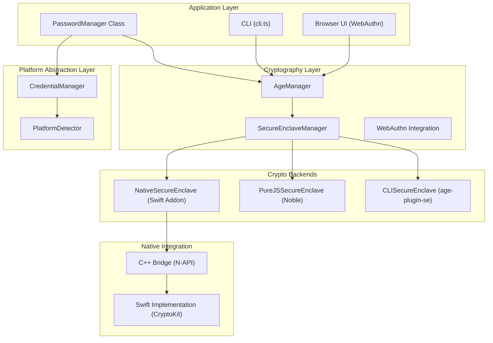
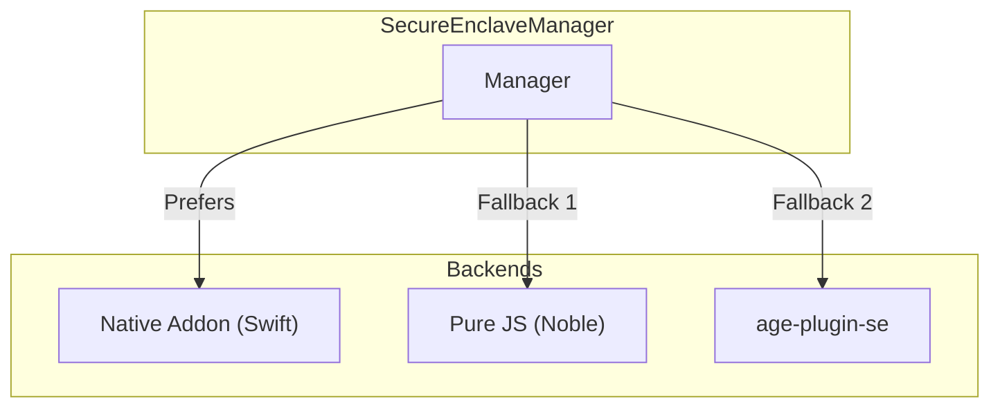

# PAK (Password Age Kit) Architecture Overview

This document provides a comprehensive overview of the `pak-lib` project's architecture. The library is designed as a versatile, cross-platform toolkit for secure password management, built upon the `age` encryption protocol. It features a layered architecture that abstracts complexity, providing both high-level APIs for ease of use and low-level access for granular control.

## High-Level Architecture

The project can be visualized as a series of layers, each with a distinct responsibility. This layered approach promotes separation of concerns and modularity.

---

## 1. Application Layer

This is the highest level, providing the primary interfaces for end-users and developers.

*   **`PasswordManager` Class:** The main entry point for programmatic use. It encapsulates all the core logic for password management, including adding, retrieving, listing, and deleting entries. It orchestrates the underlying cryptographic and platform-specific services.
*   **Command-Line Interface (`cli.ts`):** A feature-rich CLI built with `commander.js`. It exposes the library's functionality to the command line, making it a powerful tool for system administrators and developers. It serves as a practical example of how to consume the `PasswordManager` class.
*   **Browser UI (`browser-example.html`):** Demonstrates the library's isomorphic capabilities. It showcases how `pak-lib` can be used in a browser environment, leveraging web-native technologies like **WebAuthn** for passwordless, hardware-backed security.

## 2. Cryptography Layer

This layer is the core of the library's security model. It handles all encryption and decryption operations.

*   **`AgeManager`:** The central cryptographic orchestrator. It manages `age` identities and recipients and intelligently selects the appropriate encryption/decryption method based on key types (standard `age`, Secure Enclave, YubiKey) and user configuration.
*   **`SecureEnclaveManager`:** A key architectural component that acts as a **Facade** for Apple's Secure Enclave. It provides a unified API for interacting with the hardware-backed keystore, abstracting away the complexities of the different backend implementations.
*   **WebAuthn Integration:** Provides support for passwordless encryption and decryption in the browser by integrating with the Web Authentication API.

### 2.1. Secure Enclave Backends

The `SecureEnclaveManager` delegates to one of three backend implementations, ensuring both maximum security and maximum compatibility.

1.  **`NativeSecureEnclave` (Swift Addon):** The preferred backend on macOS. It uses a native Node.js addon to communicate directly with the `CryptoKit` framework, offering the highest performance and security.
2.  **`CLISecureEnclave` (age-plugin-se):** A robust fallback that wraps the `age-plugin-se` command-line tool. This provides hardware-backed security on systems where the native addon is not or cannot be built.

## 3. Platform Abstraction Layer

This layer isolates the core logic from OS-specific details, enhancing portability and maintainability.

*   **`PlatformDetector`:** A utility class that detects the current operating system (macOS, Linux, Windows, WSL) and its capabilities (e.g., Keychain support, Secure Enclave availability).
*   **`CredentialManager`:** A facade that provides a consistent API for storing and retrieving secrets from the native credential stores of different operating systems:
    *   **macOS:** Keychain (via `security` CLI).
    *   **Linux:** Secret Service API (via `secret-tool` CLI).
    *   **Windows/WSL:** Windows Credential Manager (via PowerShell and `cmdkey.exe`).

## 4. Native Integration (macOS)

This is the deepest layer, bridging the Node.js runtime with the native Swift code on macOS.

*   **C++ Bridge (`secure_enclave_addon.cpp`):** A thin translation layer built with **N-API**. It exposes the Swift functions to the JavaScript runtime, handling data type conversions (e.g., `Napi::Buffer` to `unsigned char*`) and error propagation.
*   **Swift Implementation (`SecureEnclaveSwift.swift`):** The core native logic. It uses Apple's **`CryptoKit`** and **`Security`** frameworks to perform cryptographic operations directly within the Secure Enclave. It exposes a C-compatible API (using `@_cdecl`) for the C++ bridge to consume.

This multi-language architecture is a key strength, allowing `pak-lib` to leverage the security and performance of native code while maintaining the flexibility and portability of a JavaScript library.